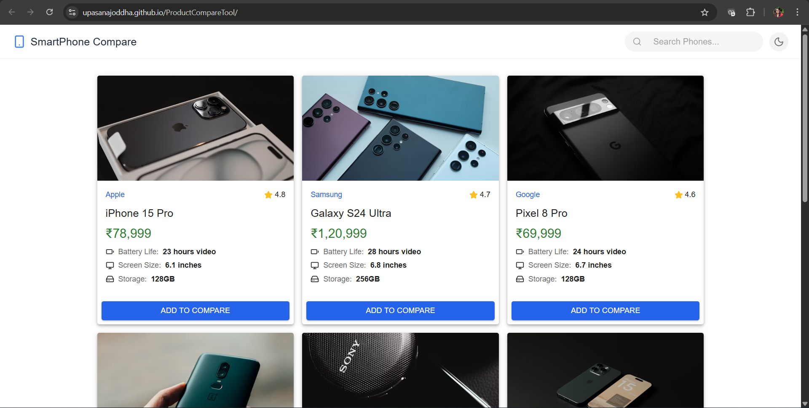
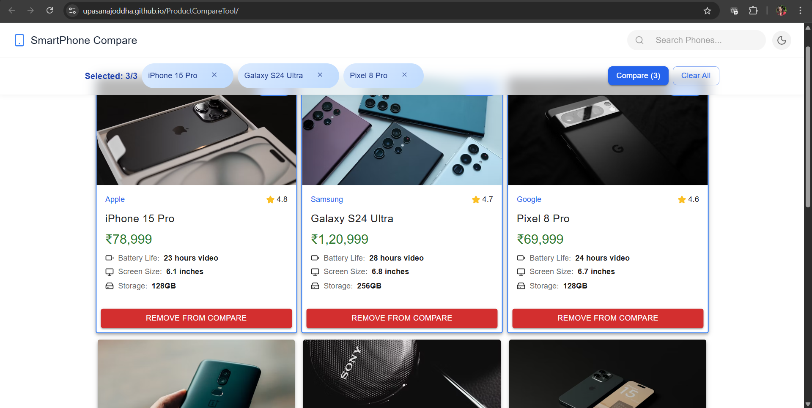
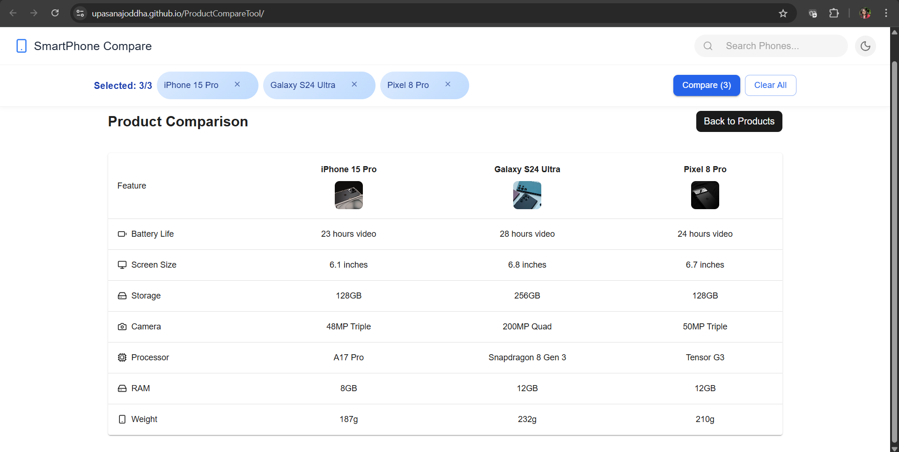
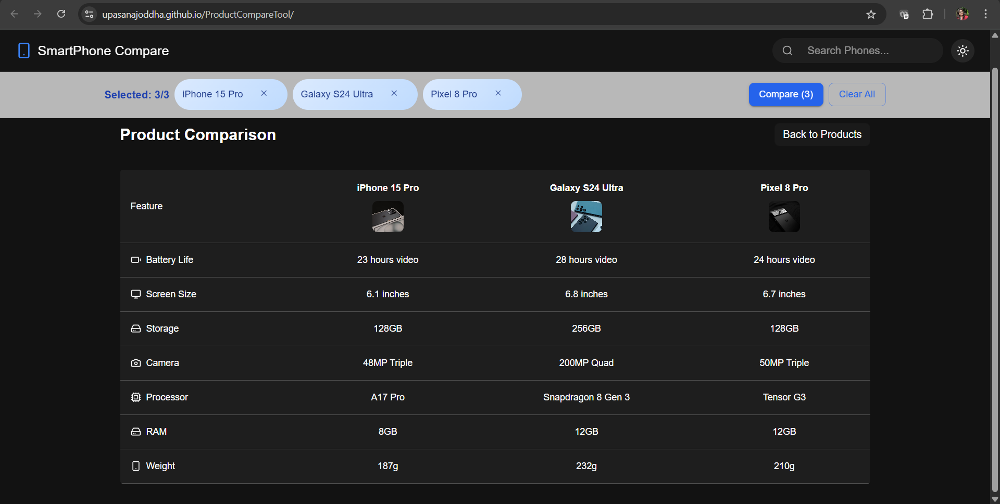
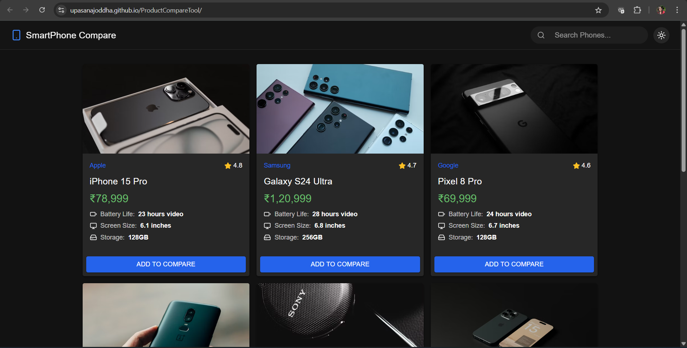
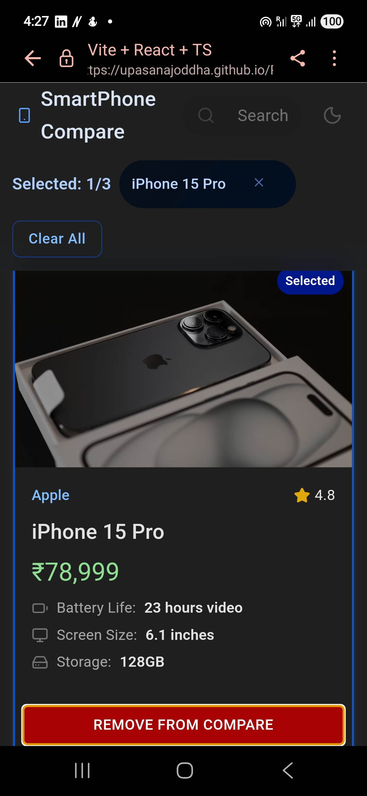

# React + TypeScript + Vite

# 🛍️ Product Comparison Tool

A simple, interactive React + TypeScript application that allows users to compare products side-by-side.  
Built with **React** and styled with CSS, the app uses **Unsplash** images for product visuals.

🌐 Live Demo
**[View Live Demo Here](https://upasanajoddha.github.io/ProductCompareTool/)**

## 🚀 Setup Instructions

### 1️⃣ Clone the repository
```bash
git clone https://github.com/your-username/product-comparison-tool.git
cd product-comparison-tool
```
### 2️⃣ Install dependencies
```
npm install
```
### 3️⃣ Run the development server
```
npm run dev
```
Open http://localhost:5173 in your browser.

✨ Features
Product Grid View – Displays 6–8 products with:

- Name
- Brand
- Image (from Unsplash)
- Price
- Key features (e.g., battery life, storage, etc.)
- Add to Compare – Select up to 3 products to compare.
- Dynamic Comparison Table – Displays selected products side-by-side.
- Responsive Design – Works on desktop and mobile.

📌 Assumptions
- Product images are sourced from Unsplash using direct URLs.
- Data is currently static (productsData array in the code).
- Comparison is limited to 3 products to keep the UI clean.
- No backend – all logic is handled client-side.


🌐 Live Demo
**[View Live Demo Here](https://upasanajoddha.github.io/ProductCompareTool/)**

📸 Screenshots









🛠 Tech Stack
- React (TypeScript)
- Material UI (UI components)
- lucide-react (icons)
- CSS for custom styling
- Unsplash for product images

